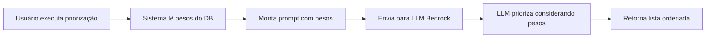

# Verificação dos Pesos na Priorização

## ✅ Sim, o sistema ESTÁ considerando os pesos!

### Como Funciona

1. **Leitura dos Pesos do Banco de Dados**
   - O sistema lê os pesos configurados na tabela `settings` do banco
   - Localização: `app/core/prioritization.py` linha 183-185

2. **Inclusão no Prompt da IA**
   - Os pesos são passados para o prompt do sistema
   - Localização: `app/core/prompts.py` linha 14-19
   - A IA recebe instruções explícitas sobre os pesos

3. **Pesos Atualmente Configurados**
   ```
   Financeiro: 50%
   Negócios:   20%
   Cliente:    10%
   OKR:        20%
   ```

### Trecho do Prompt Enviado à IA

```
Considere os seguintes pesos para a priorização (0-100%):
- Impacto Financeiro: 50%
- Impacto Negócios: 20%
- Impacto Cliente: 10%
- OKR: 20%
Itens com critérios de maior peso devem ter preferência na lista.
```

### Como Alterar os Pesos

**Via Interface Web:**
1. Acesse http://localhost:8000
2. Clique na aba "Setup"
3. Ajuste os sliders de peso
4. Clique em "Salvar Configurações"

**Via API:**
```powershell
Invoke-WebRequest -Method PUT -Uri http://localhost:8000/settings `
  -Headers @{"Content-Type"="application/json"} `
  -Body '{"peso_financeiro":40,"peso_negocios":30,"peso_cliente":20,"peso_okr":10}'
```

### Fluxo Completo



### Código Relevante

**prioritization.py (linhas 176-191):**
```python
def _obter_priorizacao_da_ia(self, df, capacidade_iniciativas):
    # Obter configurações atualizadas do banco de dados
    repo = get_repository()
    db_settings = repo.get_settings()
    weights = db_settings.model_dump()
    
    # Construir prompt com pesos
    system_message = SystemMessage(
        build_system_prompt(capacidade_iniciativas, weights)
    )
    # ... envia para LLM
```

**prompts.py (linhas 14-19):**
```python
weights_text = "\n\nConsidere os seguintes pesos para a priorização (0-100%):\n"
weights_text += f"- Impacto Financeiro: {weights.get('peso_financeiro', 25)}%\n"
weights_text += f"- Impacto Negócios: {weights.get('peso_negocios', 25)}%\n"
weights_text += f"- Impacto Cliente: {weights.get('peso_cliente', 25)}%\n"
weights_text += f"- OKR: {weights.get('peso_okr', 25)}%\n"
```

## Conclusão

✅ **Sim, os pesos estão sendo considerados!**
- Lidos do banco de dados em tempo real
- Incluídos no prompt da IA
- LLM usa os pesos para priorizar itens
- Configuráveis via interface web ou API
