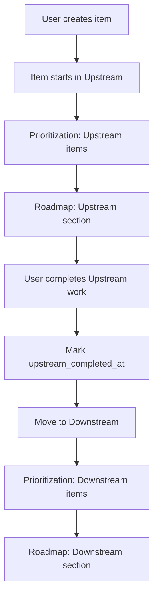

# Design: Upstream/Downstream Workflow with Capacity Allocation

## Context

ARCADIA currently treats all backlog items uniformly during prioritization and roadmap generation. The team operates with a two-stage workflow (Upstream → Downstream) plus maintenance work (Sustentação), each with different capacity allocations. This design introduces workflow stages and multi-stage capacity planning.

## Goals

1. **Enable workflow stage tracking** for backlog items (Upstream, Downstream, Sustentação)
2. **Support capacity allocation** across three categories with percentage-based distribution
3. **Enforce workflow dependencies** (items must complete Upstream before Downstream)
4. **Generate stage-aware roadmaps** showing capacity usage per stage
5. **Maintain backward compatibility** where possible

## Non-Goals

- Automatic stage transitions (manual for now)
- Time tracking within stages
- Sub-stages or more granular workflow steps
- Historical stage transition tracking (can be added later)

## Technical Decisions

### 1. Data Model

#### BacklogItem Schema Changes

```python
class BacklogItem(BaseModel):
    # ... existing fields ...
    workflow_stage: str = "upstream"  # "upstream" | "downstream" | "sustentacao"
    upstream_completed_at: Optional[datetime] = None  # Track when upstream finished
```

**Decision**: Use string enum instead of Python Enum for better JSON serialization and DynamoDB compatibility.

**Alternative Considered**: Separate tables for each stage → Rejected (too complex, harder to query)

#### SystemSettings Schema Changes

```python
class SystemSettings(BaseModel):
    # ... existing fields ...
    capacity_upstream_percent: float = 40.0
    capacity_downstream_percent: float = 40.0
    capacity_sustentacao_percent: float = 20.0
    
    @validator('capacity_sustentacao_percent')
    def validate_capacity_sum(cls, v, values):
        total = v + values.get('capacity_upstream_percent', 0) + values.get('capacity_downstream_percent', 0)
        if abs(total - 100.0) > 0.01:  # Allow small floating point errors
            raise ValueError(f"Capacity percentages must sum to 100%, got {total}%")
        return v
```

**Decision**: Store as percentages (0-100) with validation, calculate actual hours at runtime.

**Alternative Considered**: Store absolute hours → Rejected (less flexible, harder to adjust total capacity)

### 2. Capacity Calculation Logic

```python
def calculate_stage_capacities(total_capacity: float, settings: SystemSettings) -> dict:
    """Calculate capacity for each workflow stage."""
    return {
        "upstream": total_capacity * (settings.capacity_upstream_percent / 100.0),
        "downstream": total_capacity * (settings.capacity_downstream_percent / 100.0),
        "sustentacao": total_capacity * (settings.capacity_sustentacao_percent / 100.0)
    }
```

### 3. Prioritization Strategy

**Multi-Stage Prioritization**:
1. Group items by `workflow_stage`
2. Prioritize within each group separately
3. Apply capacity limit per stage
4. LLM receives stage-specific context in prompt

**LLM Prompt Enhancement**:
```
You are prioritizing {stage} items with {capacity} hours available.
- Upstream items: Discovery, research, design work
- Downstream items: Implementation (requires upstream completion)
- Sustentação items: Maintenance, bug fixes, support

Current items to prioritize:
[items filtered by stage]
```

**Decision**: Separate LLM calls per stage for clarity and better results.

**Alternative Considered**: Single LLM call with all items → Rejected (too complex, harder for LLM to manage)

### 4. Workflow Dependency Enforcement

**Rule**: Items can only be in Downstream if `upstream_completed_at` is set.

**Enforcement Points**:
- UI: Disable "Move to Downstream" button if upstream not completed
- API: Validation on item update
- Prioritization: Warn if downstream items lack upstream completion

**Decision**: Soft enforcement initially (warnings), can make strict later.

### 5. Database Migration Strategy

#### SQLite Migration

```sql
-- Add new columns with defaults
ALTER TABLE backlog_items 
ADD COLUMN workflow_stage TEXT DEFAULT 'upstream';

ALTER TABLE backlog_items 
ADD COLUMN upstream_completed_at TIMESTAMP NULL;

ALTER TABLE system_settings
ADD COLUMN capacity_upstream_percent REAL DEFAULT 40.0;

ALTER TABLE system_settings
ADD COLUMN capacity_downstream_percent REAL DEFAULT 40.0;

ALTER TABLE system_settings
ADD COLUMN capacity_sustentacao_percent REAL DEFAULT 20.0;
```

#### DynamoDB Migration

- No schema migration needed (schemaless)
- Update application code to handle missing fields gracefully
- Default to `"upstream"` if `workflow_stage` is missing
- Backfill script to update existing items (optional)

**Decision**: Graceful degradation - handle missing fields in code.

### 6. UI Component Changes

#### BacklogBoard.jsx
- Add stage filter dropdown
- Add stage badge to each card (color-coded)
- Show capacity bar per stage

#### SettingsPanel.jsx
- Add three sliders for capacity percentages
- Real-time validation (sum = 100%)
- Visual feedback if invalid

#### RoadmapView.jsx
- Group items by stage (collapsible sections)
- Show capacity usage per stage
- Workflow progression indicator

**Decision**: Use color coding - Blue (Upstream), Green (Downstream), Orange (Sustentação)

## Data Flow



## Risks & Mitigations

### Risk 1: Data Migration Complexity
**Impact**: High  
**Mitigation**: 
- Provide default values for new fields
- Create migration script with dry-run mode
- Test on copy of production data first

### Risk 2: LLM Confusion with Multi-Stage
**Impact**: Medium  
**Mitigation**:
- Clear, separate prompts per stage
- Include stage context in system message
- Add examples to few-shot prompts

### Risk 3: Capacity Validation Edge Cases
**Impact**: Low  
**Mitigation**:
- Comprehensive unit tests for validation
- UI prevents invalid input
- API returns clear error messages

### Risk 4: Performance with Large Backlogs
**Impact**: Medium  
**Mitigation**:
- Index `workflow_stage` field
- Paginate results per stage
- Cache capacity calculations

## Migration Plan

### Phase 1: Database Schema (Day 1)
1. Add new fields to models
2. Create migration scripts
3. Test migrations on dev environment
4. Deploy to dev database

### Phase 2: Backend Logic (Days 2-4)
1. Update repositories to handle new fields
2. Implement multi-stage capacity calculation
3. Update prioritization logic
4. Modify roadmap generation
5. Update API endpoints
6. Write unit tests

### Phase 3: Frontend (Days 5-7)
1. Add stage indicators to BacklogBoard
2. Implement capacity allocation in Settings
3. Update RoadmapView with stage grouping
4. Add stage filter functionality
5. Update forms to include workflow_stage

### Phase 4: Testing & Deployment (Days 8-9)
1. Integration testing
2. User acceptance testing
3. Deploy to staging
4. Production deployment
5. Monitor for issues

### Phase 5: Data Backfill (Day 10)
1. Analyze existing items
2. Run backfill script to assign stages
3. Verify data integrity

## Rollback Plan

If issues arise:
1. **Database**: Keep old schema columns, add new ones (no data loss)
2. **Code**: Feature flag to disable multi-stage logic
3. **UI**: Graceful degradation if backend doesn't support stages

## Open Questions

1. **Q**: Should we track stage transition history?  
   **A**: Not in v1, can add later if needed

2. **Q**: Can items skip Upstream and go directly to Downstream?  
   **A**: Yes, for urgent fixes or simple tasks (mark upstream_completed_at immediately)

3. **Q**: How to handle items that are partially in both stages?  
   **A**: Not supported in v1, item is in one stage at a time

4. **Q**: Should Sustentação items have different prioritization criteria?  
   **A**: Use same criteria for now, can customize later

## Success Metrics

- ✅ All backlog items have a workflow_stage assigned
- ✅ Capacity allocation sums to 100% in settings
- ✅ Roadmaps show items grouped by stage
- ✅ Prioritization respects per-stage capacity limits
- ✅ No data loss during migration
- ✅ UI clearly indicates item workflow stage
